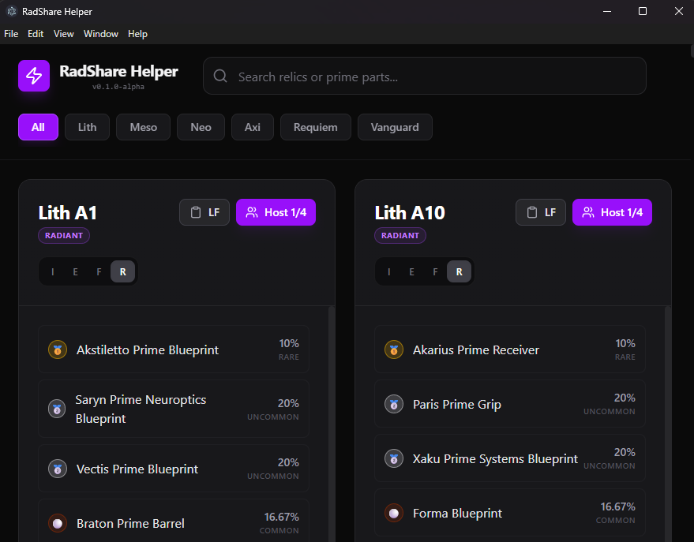

# RadShare Helper

[](https://www.warframe.com/)
[](https://github.com/taurinexd/radshare/blob/main/LICENSE)
[](https://github.com/taurinexd/radshare/stargazers)
[](https://www.paypal.com/paypalme/mmtaurine)



**RadShare Helper** is a lightweight desktop application designed to streamline recruiting for Void Relic runs in Warframe. It simplifies writing and sharing specific recruiting messages in the **Recruiting channel**, ensuring accuracy and speed.

## ✨ Features

- **Relic Database**: Instantly find any relic (Lith, Meso, Neo, Axi, Requiem, Vanguard).
- **One-Click Copy**: Automatically formats recruiting messages for your selected relic and state.
- **State Toggles**: Quickly switch between **Intact (I)**, **Exceptional (E)**, **Flawless (F)**, and **Radiant (R)**.
- **Host Mode & Cycle Counting**: 
  - Tracks host cycles (e.g., [4/4]) to help you manage your group.
  - Automatically resets after 4 invites.
  - Adds a small delay between copies to prevent chat spam blocks.
- **Modern UI**: Clean, responsive dark mode interface designed for gamers.

## 🚀 Getting Started

### For Users
1. Download the latest version from the **[Releases](https://github.com/taurinexd/radshare/releases)** page.
2. Run the installer or the portable version.
3. Search for your relic, select its state, and click **Copy** to share in the Warframe Recruiting channel.

### For Developers
If you want to run the project from source:

1. Clone the repository.
2. Install dependencies:
   ```bash
   npm install
   ```
3. Run in development mode:
   ```bash
   npm run dev
   ```
4. Build the application:
   ```bash
   npm run package
   ```

## ☕ Support

If you find this tool helpful, consider supporting the project:
- 🌟 Leave a star on GitHub.
- 🍪 [Support me on PayPal](https://www.paypal.com/paypalme/mmtaurine).

---

## ⚖️ Legal Disclaimer

**RadShare Helper** is a fan-made tool and is **NOT** affiliated with, authorized, maintained, sponsored, or endorsed by **Digital Extremes** or **Warframe**.

Warframe, all associated logos, and designs are registered trademarks of Digital Extremes. All drop data is provided by the Warframe Community.

---
Created by **[taurinexd](https://github.com/taurinexd)**
